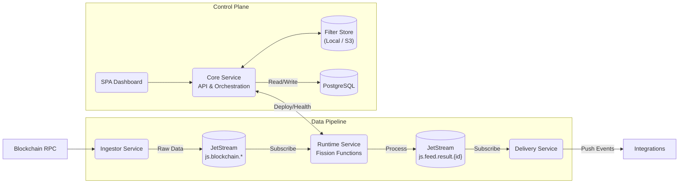

# DEVELOPERS.md

We support two development modes: **Hybrid** (recommended for speed) and **Full Docker** (for integration testing).

### Prerequisites

- **Docker**
- **.NET 10.0 SDK** (for local development)
- **Node.js** (v20+ recommended)

---

### 1. Hybrid Mode (Recommended)

Run infrastructure in Docker while executing applications locally for fast debugging and hot reload.

**Step 1: Start Infrastructure**
Launch PostgreSQL, NATS, and dashboards:
```bash
docker compose -f deploy/docker/base/docker-compose.yml up -d

# With serverless functions (k3s + Fission)
docker compose -f deploy/docker/base/docker-compose.yml --profile functions up -d
```

**Step 2: Run Services**
Run the API and Dashboard in separate terminals:
```bash
dotnet run --project src/Atria.Core.Api
dotnet run --project src/Atria.Core.Spa
```

**Step 3: Run Atria Services**
Run these individually as needed (e.g., when working on ingestion logic):
- **Ingestor**: `dotnet run --project src/Atria.Feed.Ingestor`
- **Runtime**: `dotnet run --project src/Atria.Feed.Runtime`
- **Delivery**: `dotnet run --project src/Atria.Feed.Delivery`

### 2. Full Docker Mode

Run the entire stack in containers.
```bash
docker compose -f deploy/docker/dev/docker-compose.yml up -d --build
```

---

## Architecture & Services

Atria is composed of specialized services that work together in a decoupled, event-driven architecture.

### Service Overview

| Service | Description | Local Port |
|---------|-------------|------------|
| **Web Dashboard** | Web UI (Angular) for creating and monitoring feeds. | `7150` |
| **API** | REST API (.NET) for managing feeds, outputs, and configuration. | `4300` |
| **NATS Dashboard** | UI for monitoring the JetStream message bus. | `8223` |
| **PostgreSQL** | Primary relational database. | `5432` |
| **NATS** | JetStream message broker. | `4222` |
| **Orchestrator** | Manages deployments, scaling, and health checks. | - |
| **Ingestor** | Connects to blockchain RPCs, ingests blocks/logs. | - |
| **Runtime** | Executes filters and serverless functions (via Fission). | - |
| **Fission** | Serverless functions (k3s + Fission). Optional. | `31314` |
| **Delivery** | Pushes processed data to external destinations. | - |

### System Diagram



## Code Style

Code style is enforced via **StyleCop** and validated during the build.